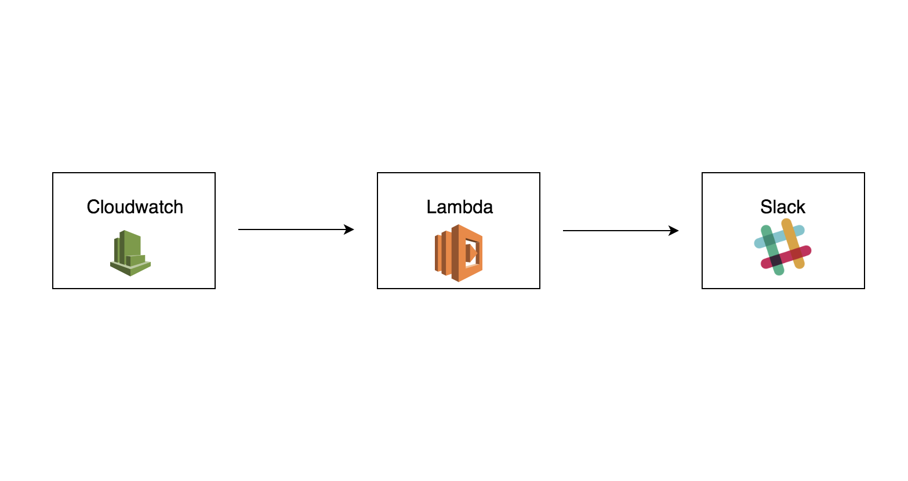
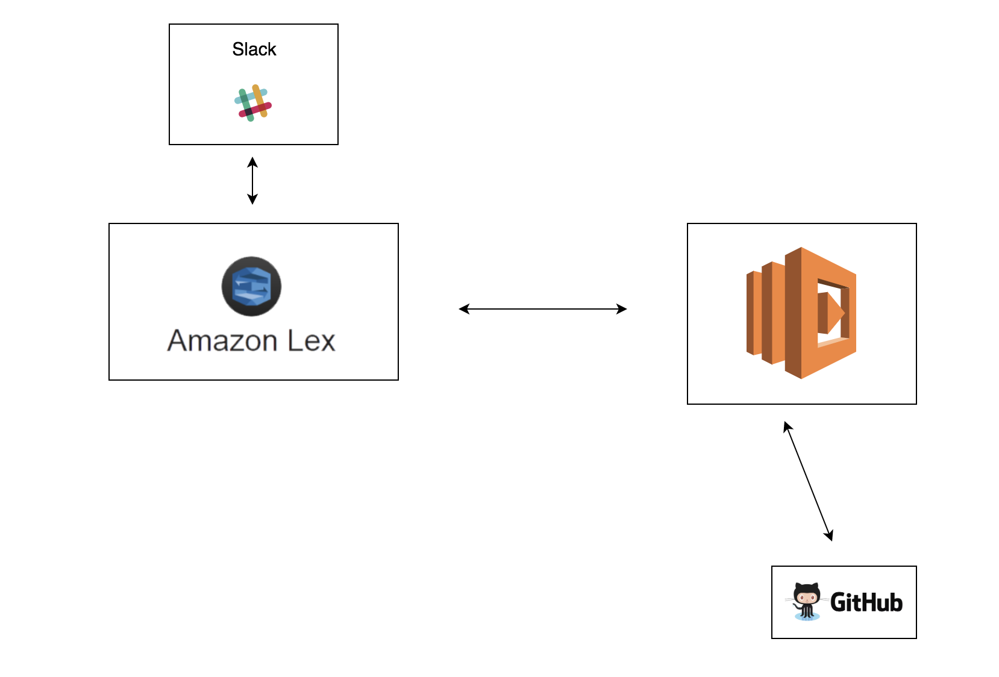
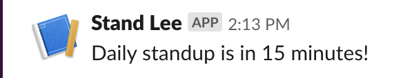
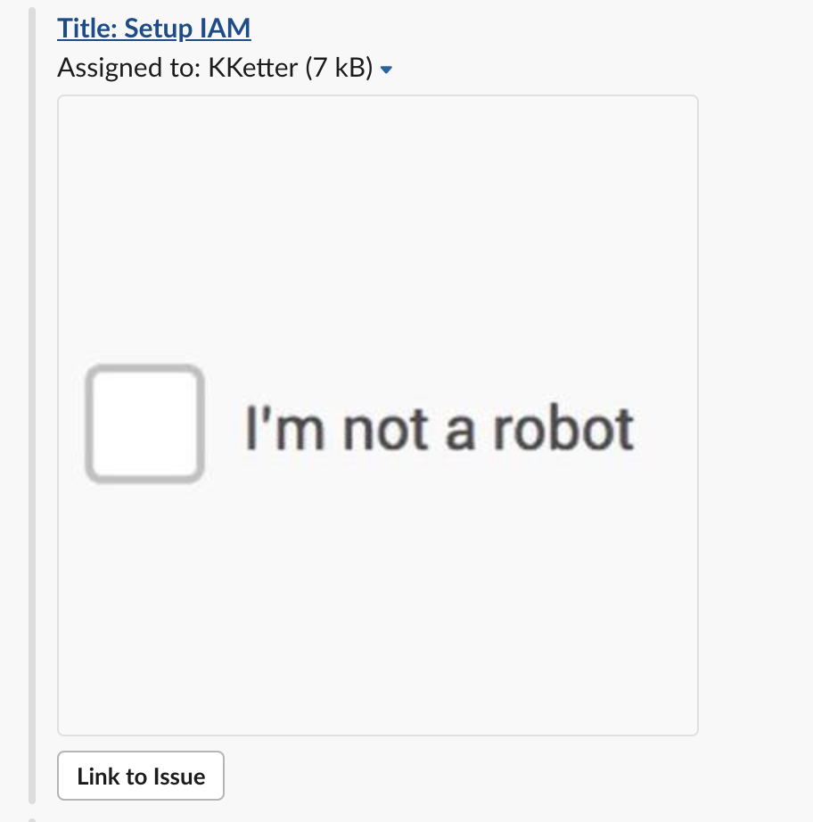

# Stand Lee (AKA reminder-bot)
## Overview
Stand Lee is a serverless slack app for sending reminders to a message group about important upcoming events and for providing general team-specific information upon request.

## Architecture

#### Reminder Feature



#### Information Feature



#### How Messages Show In The Slack Channel

&emsp;
&emsp;

&emsp;


## Technologies Used

#### AWS Services
Amazon Lex |
Lambda  |
Cloudwatch  |
IAM  |
CodePipeline

#### APIs
Slack  |
Github

## CodePipeline

The pipeline has three stages.

## Source
The source stage uses the master branch of the https://github.com/teamnotabot/reminder-bot repo.

## Build
The build stage uses an AWS Serverless Application Model template. The SAM template defines the application. The template, displayed below, specifies the lambda function location, runtime, and path of the Slack API.

```
AWSTemplateFormatVersion: '2010-09-09'
Transform: AWS::Serverless-2016-10-31
Description: Outputs the stand up reminder
Resources:
  StandupFunction:
    Type: AWS::Serverless::Function
    Properties:
      Handler: index.handler
      Runtime: nodejs10.x
      CodeUri: ./
      Events:
        SlackApi:
          Type: Api
          Properties:
            Path: /services
            Method: POST
```

The build stage also uses an AWS CodeBuild build specification that installs required packages and uploads the deployment package to Amazon S3.

```
version: 0.2
phases:
  install:
    runtime-versions:
        nodejs: 10
  build:
    commands:
      - npm install https
      - export BUCKET=lambda-deployment-artifacts-bucket
      - aws cloudformation package --template-file template.yml --s3-bucket $BUCKET --output-template-file outputtemplate.yml
artifacts:
  type: zip
  files:
    - template.yml
    - outputtemplate.yml
    
```

## Deployment
The deployment stage has an action that creates a change set for the AWS CloudFormation stack that manages the Lambda application. A change set specifies the changes that are made to the stack, such as adding new resources and updating existing resources.

## Resources used by the pipeline:

- GitHub
- CodeBuild
- S3
- Lambda
- IAM
- CloudFormation

## Helpful Documentation
 - [Amazon Lex Developer Guide](https://docs.aws.amazon.com/lex/latest/dg/what-is.html)
 - [Github Search API](https://developer.github.com/v3/search/#constructing-a-search-query)
 - [Slack API](https://api.slack.com/)
 - [Integrating Lex with Slack](https://docs.aws.amazon.com/lex/latest/dg/slack-bot-association.html)
  
## Team Members
- [Kent Ketter](https://github.com/KKetter)
- [Jhia Turner](https://github.com/jhimitu)
- [Ed Abrahamsen](https://github.com/esa2)
- [Devon Hackley](https://github.com/devonhackley)
